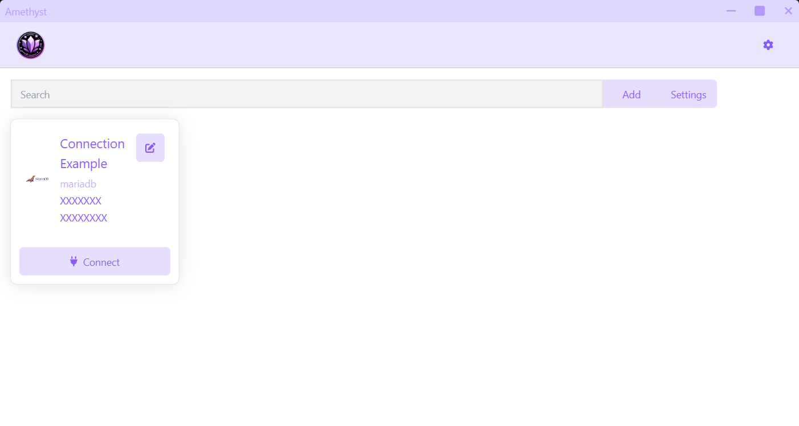

<h1 align="center">Amethyst Project</h1>
<div align="center" style="border-radius: 8px; overflow: hidden;">
    
</div>

## About

Amethyst Project is a user friendly SQL Client for all (almost) SQL databases.
<p align="center" style="color: purple; font-weight: bold; font-size: 1.2rem;">
But why ?
</p>

-   **Simple** : Amethyst Project is simple to use. Connect to your DB, and that's it !
-   **Fast** : Amethyst Project is fast. It uses the power of Electron and React to provide you the best experience possible.
-   **Beautiful** : Amethyst Project is beautiful. It uses the power of React and TailwindCSS to provide you the best experience possible.

## Features

-   [x] Connect to a database
-   [x] Execute SQL queries
-   [-] Save queries
-   [x] Save connections
-   [x] Multiple themes


## Usage

### Install Dependencies

```
# using yarn or npm
$ yarn (or `npm install`)

# using pnpm
$ pnpm install
```

### Use it

```
# development mode
$ yarn dev (or `npm run dev` or `pnpm run dev`)

# production build
$ yarn build (or `npm run build` or `pnpm run build`)
```
